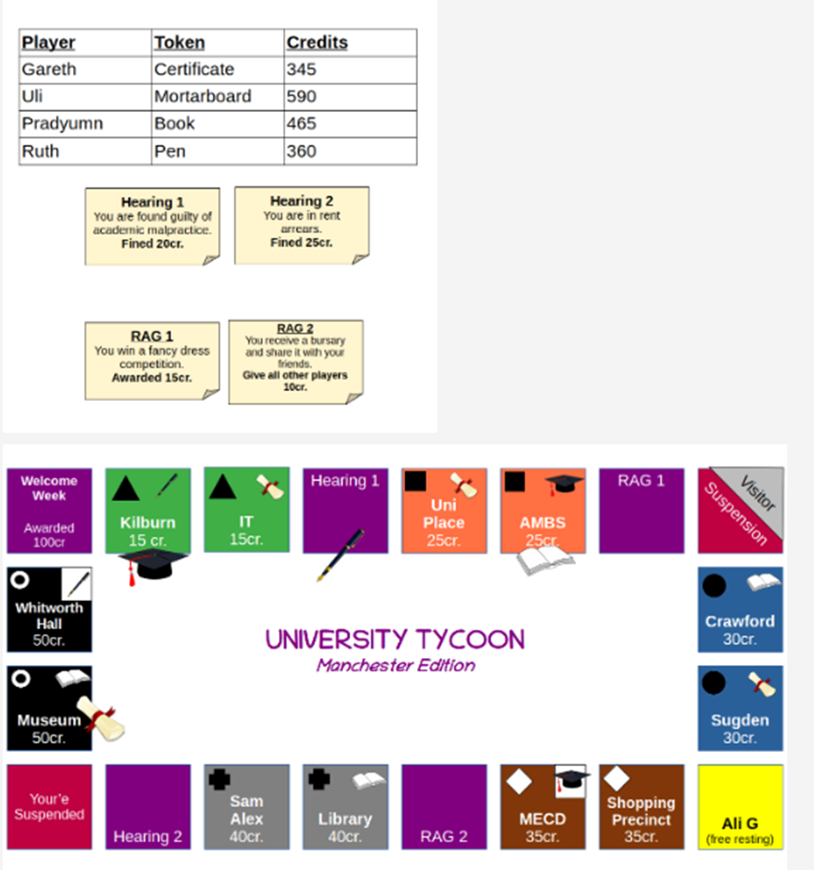

# University-Tycoon-SQLite-implementation

This repo turns the **University Tycoon** board game into a relational SQLite3 database.
It models players, tokens, buildings, specials, ownership rules, and an audit trail, then
runs SQL scripts to simulate the required gameplay rounds.

## Game board reference

The image below is the original board state used to build the database (locations, ordering,
building colours, and special tiles). The database initial state matches this setup.

## ER Diagram

Crow’s-foot ERD used to design the schema:

## What’s in this repo

- `create.sql`  
  Creates tables, constraints, and any triggers used in the implementation.

- `populate.sql`  
  Inserts the initial state exactly as given in the brief (players, tokens, locations, buildings,
  specials, starting credits/positions, and any initial ownership).

- `view.sql`  
  Creates the `leaderboard` view in the required external-client format:
  `name`, `location` (snake_case), `credits` (integer), `buildings` (snake_case list in board order).

- `q1.sql`, `q2.sql`, `q3.sql`, `q4.sql`  
  Task 4 gameplay scripts that apply the dice outcomes for Round 1 and Round 2, update game state,
  and write entries to the audit trail.

## How to run

### 1) Create a fresh database

    sqlite3 university_tycoon.db < create.sql
    sqlite3 university_tycoon.db < populate.sql
    sqlite3 university_tycoon.db < view.sql

### 2) Check the initial leaderboard

    sqlite3 university_tycoon.db "SELECT * FROM leaderboard;"

### 3) Run the gameplay scripts (Task 4)

Run them in the required order:

    sqlite3 university_tycoon.db < q1.sql
    sqlite3 university_tycoon.db < q2.sql
    sqlite3 university_tycoon.db < q3.sql
    sqlite3 university_tycoon.db < q4.sql

### 4) Verify results

Leaderboard after gameplay:

    sqlite3 university_tycoon.db "SELECT * FROM leaderboard;"

Audit trail (latest moves first):

    sqlite3 university_tycoon.db "SELECT * FROM AuditTrail ORDER BY Log_ID DESC LIMIT 20;"

## Suggested repo structure

    .
    ├── create.sql
    ├── populate.sql
    ├── view.sql
    ├── q1.sql
    ├── q2.sql
    ├── q3.sql
    ├── q4.sql
    ├── assets/
    │   ├── board.png
    │   └── erd.png
    ├── README.md
    └── .gitignore
